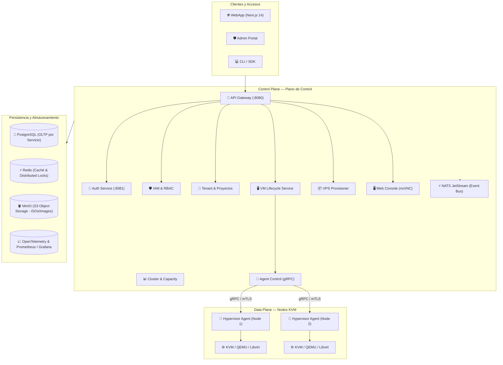

# ☁️ VPSFlow — Enterprise Cloud Infrastructure Platform

[](https://golang.org)
[](https://nextjs.org)
[](https://nats.io)
[](https://libvirt.org)
[](https://www.docker.com)
[](#license)

**VPSFlow** es una plataforma de infraestructura cloud empresarial diseñada para la gestión, orquestación y aprovisionamiento a gran escala de virtualización KVM, almacenamiento distribuido y redes definidas por software (SDN). 

Ofrece un plano de control (*Control Plane*) basado en microservicios desacoplados y orientados a eventos, agentes de alto rendimiento (*Data Plane*) desplegados directamente sobre nodos hipervisores KVM, y una interfaz web moderna (*Next.js*) orientada a desarrolladores y empresas.

---

## 📑 Tabla de Contenidos

- [Visión General y Principios de Diseño](#-visión-general-y-principios-de-diseño)
- [Arquitectura del Sistema](#-arquitectura-del-sistema)
- [Catálogo de Servicios](#-catálogo-de-servicios)
- [Pila Tecnológica](#-pila-tecnológica)
- [Estructura del Repositorio](#-estructura-del-repositorio)
- [Requisitos Previos](#-requisitos-previos)
- [Puesta en Marcha Rápida (Quickstart)](#-puesta-en-marcha-rápida-quickstart)
- [Frontend (Web App & Admin)](#-frontend-web-app--admin)
- [Contratos de API y Protocolos](#-contratos-de-api-y-protocolos)
- [Observabilidad y Monitorización](#-observabilidad-y-monitorización)
- [Seguridad y Zero Trust](#-seguridad-y-zero-trust)
- [Estrategia de Testing](#-estrategia-de-testing)
- [Licencia](#-licencia)

---

## 🎯 Visión General y Principios de Diseño

VPSFlow no es un simple panel de hosting, sino una solución cloud completa inspirada en los estándares de ingeniería más avanzados (Vercel, AWS, Stripe, Cloudflare).

| Principio | Implementación |
|-----------|----------------|
| **API First** | Contratos públicos OpenAPI 3.0 y gRPC interno con Protobuf. |
| **Event Driven** | Eventos de dominio asíncronos sobre **NATS JetStream** con patrón *Transactional Outbox*. |
| **Zero Trust** | Comunicación cifrada con **mTLS** entre microservicios y nodos KVM; RBAC atómico granular. |
| **Clean Architecture** | Aislamiento por capas de dominio, puertos y adaptadores con inyección de dependencias. |
| **Database per Service** | Cada microservicio es dueño de su esquema en PostgreSQL para evitar acoplamientos. |
| **Observabilidad por Defecto** | Logs estructurados JSON, métricas con Prometheus, trazas distribuidas con OpenTelemetry y dashboards en Grafana. |

---

## 🏛️ Arquitectura del Sistema



---

## 🧩 Catálogo de Servicios

### 1. Núcleo de Plataforma
- **`services/gateway`**: Punto de entrada perimetral (Edge API). Enrutamiento dinámico, validación de autenticación, rate limiting y CORS.
- **`services/auth`**: Autenticación centralizada con OAuth2, OpenID Connect (OIDC), JWT tokens de vida corta con rotación, MFA y soporte para Passkeys.
- **`services/iam`**: Gestión de identidades, usuarios, roles, asignaciones de permisos y evaluación de políticas.
- **`services/tenant`**: Jerarquía de organizaciones, proyectos, gestión de miembros, aislamiento multi-inquilino y cuotas de recursos.

### 2. Cómputo y Virtualización
- **`services/vm`**: Motor del ciclo de vida de máquinas virtuales (crear, arrancar, detener, pausar, reiniciar, redimensionar, snapshots y backups).
- **`services/vps`**: Capa de abstracción de productos VPS, flavors empaquetados y aprovisionamiento comercial.
- **`services/cluster`**: Inventario de hipervisores físicos, métricas de capacidad disponible (vCPU, RAM, Disco) y algoritmos de colocación.
- **`services/agent-control`**: Canal bidireccional gRPC seguro para enviar instrucciones y recibir telemetría continua de los hipervisores.
- **`services/console`**: Sesiones interactivas de consola web remota para VMs mediante WebSocket y noVNC / SPICE.

### 3. Agente de Hipervisor (*Data Plane*)
- **`agents/hypervisor-agent`**: Demonio nativo en Go ejecutado en los servidores físicos KVM/libvirt. Administra dominios QEMU, puentes de red (Linux Bridges / OVS), volúmenes de almacenamiento y monitorización en tiempo real.

### 4. Librerías Compartidas (*libs*)
- **`libs/go/config`**: Carga de configuración basada en variables de entorno tipadas y seguras.
- **`libs/go/errors`**: Sistema canónico de errores tipados con códigos de dominio y mapeo HTTP/gRPC.
- **`libs/go/httpx`**: Utilidades estándar de middleware, serialización JSON y gestión de contextos.
- **`libs/go/ids`**: Generación de identidades seguras y prefijadas (ej: `vm_xxx`, `usr_xxx`).
- **`libs/go/observability`**: Integración unificada para OpenTelemetry, Prometheus y logs estructurados Zerolog.
- **`libs/go/security`**: Validadores de tokens JWT, firma criptográfica y hashing.

---

## 🛠️ Pila Tecnológica

- **Backend**: Go 1.23+ (`go.work` multi-módulo)
- **Frontend**: Next.js 14 (App Router), React 18, TypeScript, TailwindCSS, Framer Motion, Lucide Icons, Cobe (Globo 3D interactivo)
- **Broker de Mensajería**: NATS JetStream (2.10+)
- **Bases de Datos & Caché**:
  - PostgreSQL 16 (Base de datos relacional independiente por servicio)
  - Redis 7 (Caché en memoria, sesiones, locks distribuidos)
- **Almacenamiento de Objetos**: MinIO (Compatible con Amazon S3 para ISOs, imágenes Cloud-Init y snapshots)
- **Observabilidad**:
  - OpenTelemetry Collector
  - Prometheus
  - Grafana con dashboards preconfigurados
- **Infraestructura**: Docker Compose, Kubernetes, Helm

---

## 📁 Estructura del Repositorio

```text
vpsflow/
├── agents/                  # Agentes nativos para hipervisores
│   └── hypervisor-agent/    # Demonio KVM/libvirt
├── contracts/               # Especificaciones de API
│   ├── openapi/             # Contratos REST públicos (OpenAPI 3.0)
│   └── asyncapi/            # Definiciones de eventos NATS
├── docs/                    # Documentación técnica
│   ├── architecture/        # Especificaciones arquitectónicas detalladas
│   ├── adr/                 # Architecture Decision Records (ADRs)
│   └── standards/           # Estándares de código, naming y DoD
├── frontend/                # Aplicaciones Web
│   ├── web-app/             # Portal de cliente (Next.js 14 + Tailwind)
│   └── admin-app/           # Consola de administración
├── libs/                    # Librerías compartidas (Go)
│   └── go/                  # config, errors, httpx, ids, observability, security
├── platform/                # Infraestructura como Código y Contenedores
│   ├── docker/              # Dockerfiles y docker-compose.yml local
│   └── observability/       # Configuraciones de Prometheus, OTel y Grafana
├── proto/                   # Definiciones gRPC Protobuf
├── scripts/                 # Scripts de automatización y despliegue
├── services/                # Microservicios del Control Plane en Go
│   ├── agent-control/       # Control de agentes KVM
│   ├── auth/                # Servicio de autenticación
│   ├── cluster/             # Gestión de clusters e hipervisores
│   ├── console/             # Proxy de consolas noVNC
│   ├── gateway/             # Edge API Gateway
│   ├── iam/                 # Control de acceso y roles
│   ├── tenant/              # Multi-inquilino y proyectos
│   ├── vm/                  # Ciclo de vida de máquinas virtuales
│   └── vps/                 # Aprovisionamiento de VPS
├── tests/                   # Pruebas contractuales y de integración
├── go.work                  # Configuración de Go Workspace
└── Makefile                 # Tareas automatizadas
```

---

## ⚙️ Requisitos Previos

Asegúrate de contar con las siguientes herramientas instaladas en tu entorno local:

- **Go**: `v1.23.0` o superior
- **Docker & Docker Compose**: `v24.0+`
- **Node.js**: `v20.x` o `v22.x` (con `npm` o `pnpm`)
- **Make** *(Opcional, pero recomendado)*

---

## 🚀 Puesta en Marcha Rápida (Quickstart)

### 1. Clonar el repositorio y configurar variables de entorno

```bash
# Copiar plantilla de entorno para la plataforma
cp .env.example .env
```

### 2. Iniciar la infraestructura local (Bases de datos, Broker, Observabilidad)

Puedes levantar todos los servicios base mediante Docker Compose o Makefile:

```bash
# Con Make:
make infra-up

# O directamente con Docker Compose:
docker compose -f platform/docker/docker-compose.yml up -d
```

Esto desplegará los siguientes componentes en segundo plano:
- 🐘 **PostgreSQL** (`localhost:5432`)
- ⚡ **Redis** (`localhost:6379`)
- 📨 **NATS JetStream** (`localhost:4222`, monitoring en `localhost:8222`)
- 🪣 **MinIO S3** (`localhost:9000`, Consola Web en `localhost:9001`)
- 📊 **Prometheus** (`localhost:9090`)
- 📈 **Grafana** (`localhost:3001` - user: `admin`, pass: `vpsflow_dev`)
- 🔭 **OpenTelemetry Collector** (`localhost:4317` gRPC / `4318` HTTP)

### 3. Ejecutar los Microservicios

Abre terminales dedicadas para los servicios esenciales:

```bash
# Terminal 1: Servicio de Autenticación
cd services/auth
go run ./cmd/auth

# Terminal 2: API Gateway
cd services/gateway
go run ./cmd/gateway
```

### 4. Verificar la conectividad y estado de salud

```bash
# Comprobar estado del Gateway
curl http://localhost:8080/healthz

# Registrar un usuario inicial de prueba
curl -X POST http://localhost:8080/api/v1/auth/register \
  -H "Content-Type: application/json" \
  -d '{"email":"admin@vpsflow.local","password":"SecurePassword123!","name":"VPSFlow Admin"}'
```

---

## 💻 Frontend (Web App & Admin)

El frontend de VPSFlow está construido con un enfoque **Dark Mode Premium**, animaciones con Framer Motion, tipografía **Plus Jakarta Sans** y mapas 3D interactivos:

```bash
cd frontend/web-app

# Instalar dependencias
npm install

# Copiar variables de entorno
cp .env.local.example .env.local

# Iniciar servidor de desarrollo
npm run dev
```

La aplicación estará disponible en [http://localhost:3000](http://localhost:3000).

---

## 📡 Contratos de API y Protocolos

- **REST API**: Especificaciones OpenAPI 3.0 ubicadas en `contracts/openapi/`:
  - `auth-v1.yaml`: Endpoints de autenticación, refresh tokens y sesiones.
  - `gateway-v1.yaml`: Rutas públicas perimetrales.
  - `iam-v1.yaml`: Gestión de usuarios, roles y permisos.
  - `tenant-v1.yaml`: Organizaciones y membresías.
- **Event Bus (NATS)**: Especificaciones AsyncAPI en `contracts/asyncapi/` con convención:
  `vpsflow.<context>.<entity>.<event>.v1` (ej: `vpsflow.vm.instance.created.v1`).
- **Internal RPC**: Definiciones Protocol Buffers en `proto/vpsflow/` con soporte para mTLS estricto.

---

## 📊 Observabilidad y Monitorización

| Herramienta | URL Local | Credenciales por defecto |
|-------------|-----------|--------------------------|
| **API Gateway** | `http://localhost:8080` | N/A |
| **Grafana** | `http://localhost:3001` | `admin` / `vpsflow_dev` |
| **Prometheus** | `http://localhost:9090` | N/A |
| **MinIO Console** | `http://localhost:9001` | `vpsflow_minio` / `vpsflow_minio_secret` |
| **NATS Monitor** | `http://localhost:8222` | N/A |

---

## 🔒 Seguridad y Zero Trust

- **Protección de Secretos**: Los archivos `.env`, certificados TLS (`*.pem`, `*.key`) y respaldos comprimidos están estrictamente excluidos en `.gitignore`.
- **Tokens de Corta Duración**: Los tokens JWT expiran en 15 minutos y se renuevan mediante refresh tokens con detección de reuso y almacenamiento en Redis.
- **Comandos de Hipervisor Cifrados**: La comunicación entre `agent-control` y los hipervisores KVM se realiza exclusivamente mediante gRPC con autenticación mutua (mTLS).

---

## 🧪 Estrategia de Testing

```bash
# Ejecutar todas las pruebas unitarias y de concurrencia (-race)
make test

# O ejecutar pruebas individuales con Go:
cd libs/go/config && go test -race ./...
cd ../../../services/auth && go test -race ./...
cd ../gateway && go test -race ./...
```

---

## 📄 Licencia

Propiedad de **VPSFlow**. Todos los derechos reservados. Uso no autorizado o distribución prohibida.
