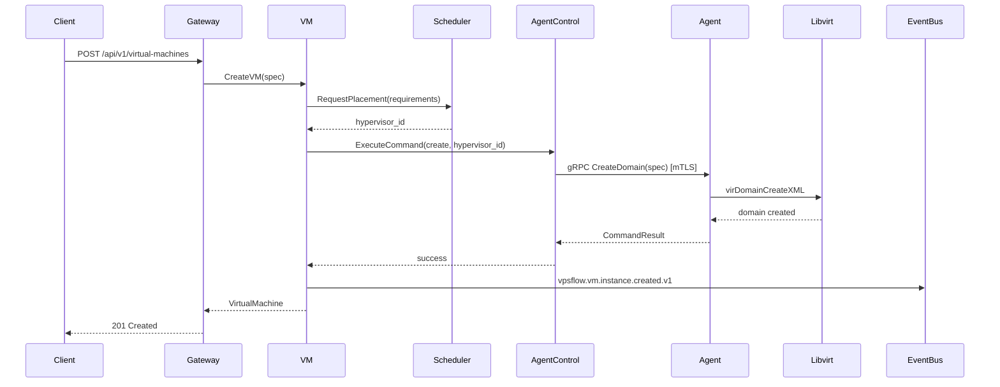

# Compute Control Plane Architecture

## Overview

The compute layer manages virtual machine lifecycle across a fleet of KVM hypervisors. Each hypervisor runs a VPSFlow Agent that executes Libvirt/QEMU operations under command from the control plane.



## Services

### cluster

**Responsibilities**:
- Hypervisor node registration and health monitoring
- Cluster grouping and capacity aggregation
- Node metadata (CPU, RAM, storage pools, network bridges)
- Maintenance mode and draining

**Database**: `vpsflow_cluster`

**Key tables**:
- `hypervisors` — registered KVM nodes
- `clusters` — logical groupings of hypervisors
- `cluster_members` — hypervisor-to-cluster mapping
- `node_capacity` — real-time resource availability
- `maintenance_windows` — scheduled maintenance

### agent-control

**Responsibilities**:
- Secure bidirectional channel to hypervisor agents
- Command dispatch with timeout and retry
- Agent registration and certificate management
- Command queue per hypervisor
- Heartbeat monitoring

**Communication**: gRPC over mTLS (agent initiates persistent connection)

**Key operations**:
- `RegisterAgent` — initial agent enrollment with CSR
- `ExecuteCommand` — dispatch operation to specific agent
- `StreamMetrics` — receive real-time metrics from agent
- `Heartbeat` — agent liveness signal

### vm

**Responsibilities**:
- VM lifecycle state machine
- Cloud-init configuration generation
- VM specification management
- Operation idempotency via `idempotency_key`
- Status tracking and event publication

**Database**: `vpsflow_vm`

**State machine**:
```
pending → provisioning → running → stopping → stopped
                      → error
running → migrating → running
stopped → starting → running
any → deleting → deleted
running → reinstalling → running
```

**Key tables**:
- `virtual_machines` — VM records
- `vm_operations` — idempotent operation tracking
- `vm_specs` — desired state configuration
- `cloud_init_configs` — cloud-init userdata/metadata
- `outbox_events`

### console

**Responsibilities**:
- Ephemeral console session tokens
- noVNC/SPICE proxy setup
- Session timeout and access control
- Console access audit logging

**Flow**:
1. Client requests console access for VM
2. Console service validates permission (`vm.console`)
3. Issues short-lived token (5 min TTL)
4. Proxies WebSocket to agent's VNC/SPICE port
5. Session ends on disconnect or timeout

### scheduler

**Responsibilities**:
- VM placement across hypervisors
- Resource requirement matching (CPU, RAM, disk)
- Anti-affinity rules (spread VMs across nodes)
- Affinity rules (co-locate related VMs)
- Overcommit policies

**Placement algorithm**:
1. Filter: nodes with sufficient resources
2. Filter: nodes matching network/storage requirements
3. Filter: exclude maintenance/draining nodes
4. Score: balance load, respect affinity/anti-affinity
5. Select: highest scoring node

### migration

**Responsibilities**:
- Cold migration orchestration
- Live migration with progress tracking
- Pre-migration validation (compatibility, resources)
- Rollback on failure
- Post-migration verification

## Hypervisor Agent

### vpsflow-agent

Deployed as systemd service on every KVM node.

**Responsibilities**:
- mTLS connection to agent-control (persistent gRPC stream)
- Libvirt domain management (create, start, stop, destroy, define)
- Disk operations (create, resize, snapshot)
- Network bridge/OVS management
- Cloud-init ISO generation and attachment
- Metrics collection (CPU, RAM, disk I/O, network)
- Migration execution (source and destination roles)
- Configuration enforcement

**Package structure**:
```
agents/hypervisor-agent/
  cmd/agent/
  internal/
    domain/
    usecase/
    port/
    adapter/
      grpc/        # Connection to agent-control
      libvirt/     # Libvirt/QEMU operations
      network/     # Bridge/OVS management
      storage/     # ZFS/local disk operations
      metrics/     # Node metrics collection
    config/
```

### Agent Security

- Agent certificate signed by VPSFlow internal CA
- Certificate rotation every 90 days (automated)
- Agent identity bound to `hypervisor_id`
- Commands validated against agent's registered hypervisor
- No inbound ports on hypervisor (agent connects outbound)

### Agent Protocol (gRPC)

See [agent.proto](../../proto/vpsflow/agent/v1/agent.proto)

## Idempotency Model

All VM operations support idempotency:

```
POST /api/v1/virtual-machines
Headers:
  Idempotency-Key: idk_01HXYZ...
```

1. VM service checks `vm_operations` table for existing key
2. If found and completed → return cached result
3. If found and in-progress → return 409 Conflict
4. If not found → create operation record, execute, store result

## Events

| Event | Trigger |
|-------|---------|
| `vpsflow.vm.instance.created.v1` | VM provisioned successfully |
| `vpsflow.vm.instance.started.v1` | VM started |
| `vpsflow.vm.instance.stopped.v1` | VM stopped |
| `vpsflow.vm.instance.deleted.v1` | VM deleted |
| `vpsflow.vm.instance.error.v1` | VM entered error state |
| `vpsflow.cluster.hypervisor.registered.v1` | New hypervisor joined |
| `vpsflow.migration.started.v1` | Migration initiated |
| `vpsflow.migration.completed.v1` | Migration finished |

## Sprint 3-4 Implementation Order

1. **cluster** — Hypervisor registration, capacity reporting
2. **agent-control** — gRPC server, agent connection management
3. **hypervisor-agent** — Libvirt adapter, mTLS client, heartbeat
4. **vm** — Create/start/stop/delete with idempotency
5. **console** — noVNC proxy with ephemeral tokens
6. **scheduler** — Basic placement (round-robin → resource-aware)
7. **migration** — Cold migration (Sprint 4), live migration (Sprint 5)

## Testing Strategy

- Unit: state machine transitions, placement scoring, idempotency logic
- Integration: agent-control ↔ agent with Testcontainers + mock libvirt
- Lab: real KVM node with libvirt for E2E VM lifecycle
- Performance: concurrent VM creation (target: 50 VMs/min per cluster)
- Chaos: agent disconnect during operation, hypervisor failure during migration

## Capacity Planning

| Scale | Hypervisors | VMs | Agent Connections | Scheduler QPS |
|-------|-------------|-----|-------------------|---------------|
| Small | 1-10 | <500 | 10 persistent gRPC | 100/s |
| Medium | 10-100 | <5,000 | 100 persistent gRPC | 500/s |
| Large | 100-1,000 | <50,000 | 1,000 persistent gRPC | 2,000/s |
| Enterprise | 1,000+ | 50,000+ | Horizontal agent-control shards | 10,000/s |
