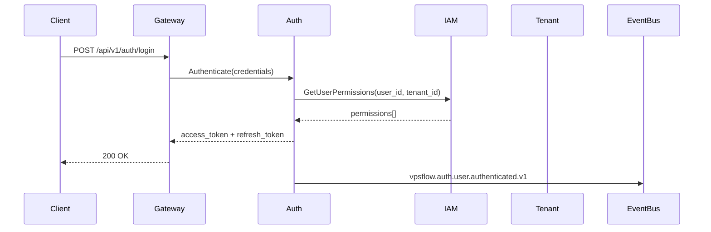

# Identity & Tenancy Architecture

## Overview

The identity layer provides authentication, authorization, and multi-tenant isolation for all VPSFlow services. It consists of four core services deployed in Sprint 1-2.



## Services

### gateway (Sprint 0 — Foundation, Sprint 1 — Auth Integration)

**Current state**: Operational with health, metrics, tracing.

**Sprint 1 additions**:
- JWT validation middleware (delegates to auth service for introspection)
- Tenant context extraction from token claims
- Rate limiting per tenant/IP
- Request forwarding to downstream services
- CSRF protection for browser flows

### auth

**Responsibilities**:
- OAuth2 Authorization Code + PKCE
- OIDC provider integration (Google, Azure AD, custom)
- JWT access token issuance (short-lived, 15 min)
- Refresh token rotation (single-use, family detection)
- MFA: TOTP, WebAuthn/passkeys
- Session management and revocation
- Password hashing (argon2id)

**Database**: `vpsflow_auth`

**Key tables**:
- `users` — global user identity
- `credentials` — password hashes, MFA secrets
- `sessions` — active sessions with device fingerprint
- `refresh_tokens` — token families for rotation
- `oauth_providers` — OIDC provider configs
- `webauthn_credentials` — passkey registrations
- `outbox_events` — transactional event publication

**Events published**:
- `vpsflow.auth.user.registered.v1`
- `vpsflow.auth.user.authenticated.v1`
- `vpsflow.auth.user.mfa_enabled.v1`
- `vpsflow.auth.session.revoked.v1`

### iam

**Responsibilities**:
- Role and permission management
- Policy evaluation engine
- User-role assignments per tenant
- Permission caching with event-driven invalidation
- Service account management

**Database**: `vpsflow_iam`

**Key tables**:
- `roles` — role definitions per tenant
- `permissions` — atomic permission catalog (platform-wide)
- `role_permissions` — role-to-permission mapping
- `user_roles` — user-to-role assignment (scoped by tenant)
- `policies` — optional ABAC policies (future)
- `outbox_events`

**Permission model** (atomic permissions):
```
vm.create, vm.read, vm.update, vm.delete, vm.console
network.create, network.read, network.update, network.delete
storage.create, storage.read, storage.update, storage.delete
tenant.manage, tenant.billing, tenant.members
iam.roles.manage, iam.users.manage
audit.read, admin.hypervisors.manage
```

**Platform roles** (predefined):
| Role | Scope | Key Permissions |
|------|-------|-----------------|
| platform_admin | Global | All permissions |
| platform_support | Global | Read + limited write |
| platform_auditor | Global | audit.read |

**Tenant roles** (per organization):
| Role | Permissions |
|------|-------------|
| owner | All tenant permissions |
| admin | All except tenant.delete, billing.manage |
| operator | vm.*, network.*, storage.* |
| billing | tenant.billing, audit.read |
| viewer | *.read |

### tenant

**Responsibilities**:
- Organization (tenant) lifecycle
- Project management within tenants
- Member invitations and membership
- Tenant quotas and limits
- Tenant-level settings

**Database**: `vpsflow_tenant`

**Key tables**:
- `organizations` — tenant entities
- `projects` — resource grouping within tenant
- `memberships` — user-to-organization mapping with status
- `invitations` — pending member invitations
- `quotas` — resource limits per tenant
- `outbox_events`

## Multi-Tenant Isolation

### Enforcement layers

1. **Gateway**: Extract `tenant_id` from JWT, inject as header `X-Tenant-ID`
2. **Service middleware**: Validate tenant context on every request
3. **Database**: Row-level filtering by `tenant_id` on all queries
4. **Events**: `tenant_id` required in every event envelope
5. **gRPC**: `TenantContext` message in all internal calls

### Tenant context propagation

```go
type TenantContext struct {
    TenantID    string
    ProjectID   string
    ActorID     string
    Permissions []string
}
```

## Authentication Flows

### Email/Password Login
1. Client → Gateway → Auth: credentials
2. Auth validates password (argon2id)
3. If MFA enabled → return `mfa_required` challenge
4. Auth queries IAM for permissions
5. Issue JWT with claims: `sub`, `tenant_id`, `permissions`, `exp`
6. Publish `user.authenticated` event

### OIDC Login
1. Client redirects to Auth `/oauth/authorize`
2. Auth redirects to OIDC provider
3. Callback validates ID token
4. Create/link user, issue VPSFlow JWT
5. Same permission resolution as password flow

### API Key Authentication
1. Client sends `Authorization: Bearer bc_live_...`
2. Gateway validates key hash against auth service
3. Key scoped to tenant + permissions
4. No refresh token — key rotation via API

## JWT Token Structure

```json
{
  "sub": "usr_01HXYZ...",
  "tenant_id": "org_01HXYZ...",
  "project_id": "prj_01HXYZ...",
  "permissions": ["vm.create", "vm.read", "network.read"],
  "iss": "vpsflow",
  "aud": "vpsflow-api",
  "exp": 1710000000,
  "iat": 1709999100,
  "jti": "tok_01HXYZ..."
}
```

## gRPC Internal Contracts

See:
- [auth.proto](../../proto/vpsflow/auth/v1/auth.proto)
- [iam.proto](../../proto/vpsflow/iam/v1/iam.proto)
- [tenant.proto](../../proto/vpsflow/tenant/v1/tenant.proto)

## REST Public Contracts

See:
- [auth-v1.yaml](../../contracts/openapi/auth-v1.yaml)
- [iam-v1.yaml](../../contracts/openapi/iam-v1.yaml)
- [tenant-v1.yaml](../../contracts/openapi/tenant-v1.yaml)

## Sprint 1 Implementation Order

1. **auth** — User registration, login, JWT issuance, refresh rotation
2. **iam** — Permission catalog, role CRUD, policy evaluation endpoint
3. **tenant** — Organization CRUD, membership, invitations
4. **gateway** — JWT middleware, tenant context injection, route proxying

## Security Requirements

- Password minimum: 12 chars, complexity rules
- Account lockout after 5 failed attempts (15 min cooldown)
- Refresh token rotation with family invalidation on reuse detection
- MFA required for admin/owner roles
- All auth events audited to ClickHouse via audit service
- Rate limit: 10 login attempts/min per IP

## Testing Strategy

- Unit: password hashing, JWT claims, permission evaluation
- Integration: full login flow with Testcontainers (PostgreSQL + Redis)
- Contract: OpenAPI validation for all auth endpoints
- E2E: register → login → MFA → access protected resource → logout
- Security: brute force simulation, token replay, refresh rotation abuse
