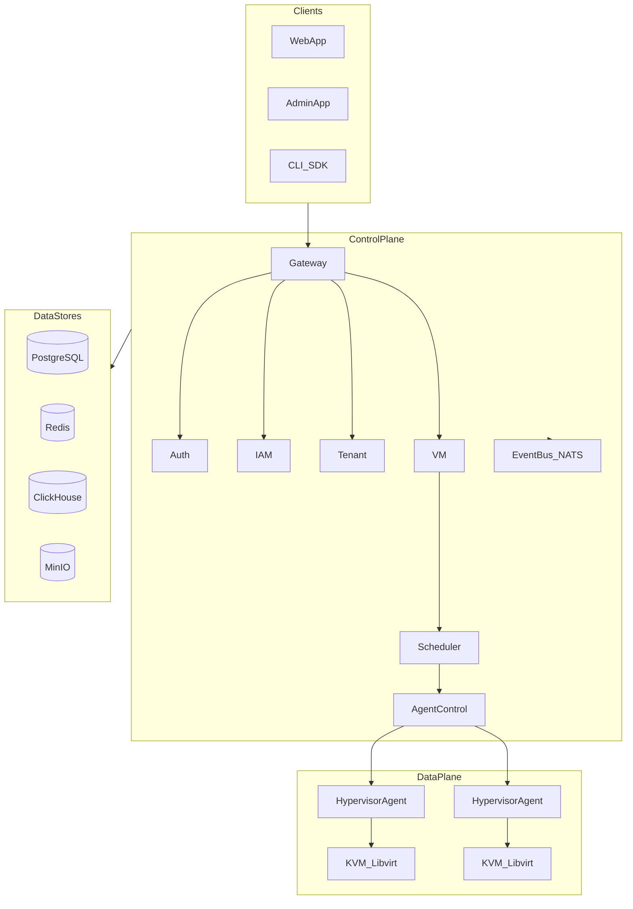

# BossCloud Architecture Overview

## Vision

BossCloud is an enterprise cloud infrastructure platform for managing KVM virtualization at scale. It provides a modern control plane with secure multi-tenant operations, event-driven microservices, and hypervisor agents on every KVM node.

## High-Level Architecture

## Architectural Principles

| Principle | Implementation |
|-----------|----------------|
| API First | OpenAPI public contracts, protobuf internal gRPC |
| Event Driven | NATS JetStream with transactional outbox |
| Zero Trust | mTLS between services and agents, RBAC enforcement |
| Clean Architecture | Domain isolation, ports/adapters, DI by constructor |
| Database per Service | PostgreSQL schema ownership per microservice |
| Observability by Default | Structured logs, Prometheus metrics, OTel traces |

## Service Catalog

### Platform Core
- **gateway** — API edge, routing, rate limiting
- **auth** — OAuth2/OIDC, JWT, MFA, passkeys
- **iam** — Users, roles, permissions, policy evaluation
- **tenant** — Organizations, projects, memberships

### Compute
- **cluster** — Hypervisor inventory and capacity
- **agent-control** — Secure command channel to agents
- **vm** — VM lifecycle management
- **console** — Remote console sessions (noVNC/SPICE)
- **scheduler** — VM placement and anti-affinity
- **migration** — Live/cold migration orchestration

### Infrastructure
- **network**, **firewall**, **ipam**, **dns**
- **storage**, **snapshot**, **backup**
- **template**, **image**, **iso**

### Governance
- **audit**, **activity**, **notification**
- **billing**, **licensing**
- **marketplace**, **plugin-manager**

## Communication Patterns

### Synchronous
- Public REST via Gateway (`/api/v1`)
- Internal gRPC with mTLS between services
- WebSocket for real-time console and metrics

### Asynchronous
- Domain events via NATS JetStream
- Event naming: `bosscloud.<context>.<entity>.<event>.v1`
- At-least-once delivery with idempotent consumers
- Transactional outbox per service

## Security Model

- Short-lived JWT access tokens with rotating refresh tokens
- RBAC with atomic permissions per tenant
- mTLS for all internal and agent communication
- Audit trail for all sensitive operations
- Rate limiting, CSRF, CSP, XSS protection at edge

## Data Strategy

| Store | Purpose |
|-------|---------|
| PostgreSQL | OLTP per service, transactional data |
| Redis | Cache, distributed locks, rate limits |
| ClickHouse | Audit logs, activity analytics |
| MinIO | Object storage (images, ISOs, backups) |

## Deployment Model

- Control Plane: Kubernetes with Helm charts
- Hypervisor Agent: systemd service on KVM nodes
- GitOps CD with progressive rollout (canary/blue-green)
- Multi-environment: dev → staging → prod

## Related Documents

- [Getting Started](../getting-started.md)
- [Identity Architecture](../architecture/identity.md)
- [Compute Architecture](../architecture/compute.md)
- [Quality Gates](../standards/quality-gates.md)
- [ADRs](../adr/)
