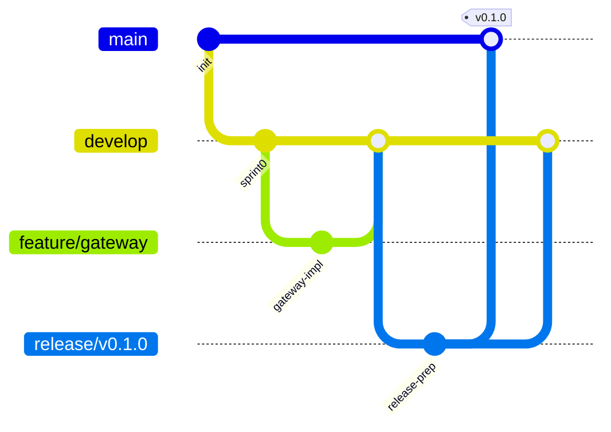

# Branching Strategy

## Branches

| Branch | Purpose | Protected |
|--------|---------|-----------|
| `main` | Production releases | Yes |
| `develop` | Integration branch | Yes |
| `feature/*` | New features | No |
| `fix/*` | Bug fixes | No |
| `release/*` | Release preparation | Yes |
| `hotfix/*` | Production hotfixes | No |

## Workflow (GitFlow Adapted)



## Rules

1. **Never commit directly to `main` or `develop`**
2. Feature branches created from `develop`
3. PR required with at least 1 approval
4. CI must pass before merge
5. Squash merge for feature branches
6. Release branches created from `develop`, merged to `main` and back to `develop`
7. Hotfix branches created from `main`, merged to both `main` and `develop`

## Commit Convention

```
<type>(<scope>): <description>

[optional body]

[optional footer: Closes #123]
```

Types: `feat`, `fix`, `docs`, `refactor`, `test`, `chore`, `ci`, `perf`, `security`

## Versioning

Semantic Versioning (SemVer): `MAJOR.MINOR.PATCH`

- MAJOR: breaking API changes
- MINOR: new features, backward compatible
- PATCH: bug fixes, backward compatible
