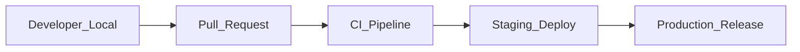

# Quality Gates

Mandatory quality checkpoints enforced at every stage of development. No code merges or releases without passing all applicable gates.

## Gate Levels

## 1. Developer Local Gates

Must pass before pushing:

| Gate | Command | Threshold |
|------|---------|-----------|
| Format | `go fmt ./...` | Zero diff |
| Vet | `go vet ./...` | Zero issues |
| Unit tests | `go test ./...` | All pass |
| Race detector | `go test -race ./...` | All pass |

## 2. Pull Request Gates

Enforced by CI (`.github/workflows/ci.yml`):

| Gate | Tool | Requirement |
|------|------|-------------|
| Go lint & vet | `go vet` | Zero issues |
| Unit tests | `go test -race -count=1` | All pass |
| Build | `go build` | Successful compilation |
| Contract validation | Swagger Editor Validate | OpenAPI spec valid |
| Docker build | `docker build` | Image builds successfully |
| Security scan | `govulncheck` | No known vulnerabilities |
| Code review | GitHub PR review | Minimum 1 approval |

### PR Checklist (required in description)

- [ ] Tests added/updated for all changes
- [ ] No TODOs, stubs, or empty functions
- [ ] API contracts updated if endpoints changed
- [ ] README updated if behavior changed
- [ ] ADR written if architectural decision made
- [ ] No secrets in code

## 3. CI Pipeline Gates

### Per-Service Requirements

Every service must have:

| Artifact | Required |
|----------|----------|
| `Dockerfile` | Yes |
| `README.md` | Yes |
| `go.mod` / `package.json` | Yes |
| Health endpoints (`/healthz`, `/readyz`) | Yes |
| Metrics endpoint (`/metrics`) | Yes |
| Structured logging | Yes |
| Graceful shutdown | Yes |
| Environment-based config | Yes |
| Unit tests | Yes (>70% coverage) |
| Migrations (if DB) | Yes |

### Coverage Thresholds

| Layer | Minimum Coverage |
|-------|-----------------|
| Domain / Usecase | 85% |
| Adapters | 70% |
| Overall per service | 70% |
| Critical paths (auth, VM lifecycle) | 90% |

## 4. Contract Gates

| Contract Type | Location | Validation |
|---------------|----------|------------|
| OpenAPI (REST) | `contracts/openapi/` | Swagger validate in CI |
| AsyncAPI (Events) | `contracts/asyncapi/` | Manual review + lint |
| Protobuf (gRPC) | `proto/bosscloud/` | `buf lint` (future) |

### Contract Change Rules

- Adding optional fields: non-breaking (same version)
- Removing/renaming fields: requires new major version
- New endpoints: non-breaking within same version
- Contract changes require contract test updates

## 5. Security Gates

| Check | Tool | Frequency |
|-------|------|-----------|
| Dependency vulnerabilities | `govulncheck` | Every PR |
| Container scanning | Trivy (future) | Every PR |
| SAST | gosec (future) | Every PR |
| Secret detection | gitleaks (future) | Every PR |
| mTLS validation | Integration tests | Per service with gRPC |

### Security Requirements per Service

- Input validation on all endpoints
- Authentication enforced on protected routes
- Authorization checked via IAM policy evaluation
- Rate limiting on public endpoints
- No PII in logs
- Secrets via environment variables only

## 6. Staging Gates

Before promoting to production:

| Gate | Requirement |
|------|-------------|
| E2E tests | Critical paths pass in staging |
| Performance | p95 latency within SLO |
| Migration test | Forward + backward migration verified |
| Smoke test | Health checks green on all services |
| Observability | Dashboards and alerts configured |

## 7. Production Release Gates

| Gate | Requirement |
|------|-------------|
| Staging validation | All staging gates passed |
| Change approval | Release manager sign-off |
| Rollback plan | Documented and tested |
| Monitoring | Alerts active for new deployment |
| Canary/blue-green | Progressive rollout configured |

## 8. Sprint Completion Gates

A sprint is complete only when:

- [ ] All sprint stories meet Definition of Done
- [ ] All CI gates green on `develop`
- [ ] Documentation updated (architecture, ADRs, READMEs)
- [ ] No critical/high security findings open
- [ ] Demo recorded or staging environment validated
- [ ] Retrospective completed with action items

## Enforcement

Gates are enforced through:

1. **GitHub branch protection** on `main` and `develop`
2. **CI workflow** (`.github/workflows/ci.yml`) — automated checks
3. **PR templates** — manual checklist
4. **Code review** — human verification
5. **Definition of Done** — sprint-level validation

## Metrics

Track gate effectiveness:

| Metric | Target |
|--------|--------|
| CI pass rate (first attempt) | >90% |
| Mean time to fix CI failure | <30 min |
| Production incidents from missed gates | 0 |
| Test coverage trend | Increasing per sprint |
